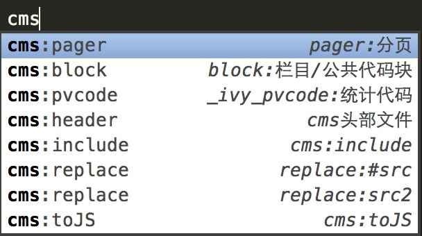

# 插件说明

## 安装

1. 第一种方式：推荐方式，把整个仓库clone到本地，因为后面会有更新；
2. 第二种方式：直接“download zip”；
3. 以上任意形式下载到包，然后把包（zip的话要解压）放到sublime 的packages 目录里面；
4. 配置代码提示模式，调出COMMAND PANNEL(ctrl + shift + p)，然后输入 `setu`回车，则可以修改Preferences.sublime-settings文件，如果文件为空则加入：

		{
			"auto_complete_selector": "source,text"
		}
否则在最后加入：

		"auto_complete_selector": "source,text"
		
5. 在html文件中，任意位置中输入cms，如果出现如下提示就代表安装成功。

## CMS

### 分类

CMS部分主要分为两类置标：cms:为前缀的置标和data:为前缀的置标，调用时的区分也是根据这个逻辑来区分的。 

### 快捷方式

1. cmsout，包含cms:outline的常用置标
2. cmsart，包含cms:article的常用置标
3. cmscha，包含cms:channel的常用置标
4. 其余的就是一些零散的常用置标，大家看注释

